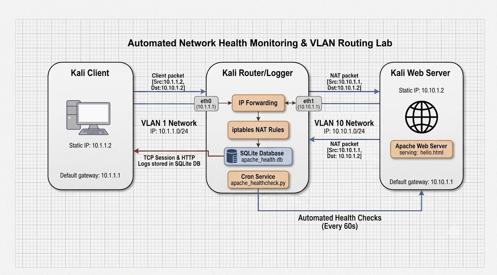

# Automated Network Health Monitoring & VLAN Routing Lab

A dual subnet enterprise network simulation featuring VLAN routing, NAT, iptables , packet capture, and a custom Python/SQLite automated health monitoring daemon.

##  Overview
This project models an enterprise network environment across three Kali Linux virtual machines. Beyond foundational routing and security configurations, it implements a continuous health monitoring system on the router node to automatically audit web service uptime, log HTTP response state to an SQLite database, and alert on service degradation.

* **Client Node (10.1.1.2):** Isolated client generating traffic across VLAN boundaries.
* **Router / Automation Host (10.1.1.1 / 10.10.1.1):** Dual homed Linux router managing IP forwarding, iptables, and running the Python health check daemon via cron.
* **Web Server Node (10.10.1.2):** Hosts an Apache2 HTTP service serving cross subnet requests.

## Technology Stack
* **Operating Systems & Hypervisor:** Kali Linux, VMware / VirtualBox
* **Networking & Security:** IPv4 Subnetting, VLAN Routing, Linux Kernel IP Forwarding, iptables
* **Traffic Analysis:**  Wireshark
* **Web Services:** Apache2
* **Automation & Storage:** Python 3, SQLite, Cron, DB Browser for SQLite

## Network Topology

